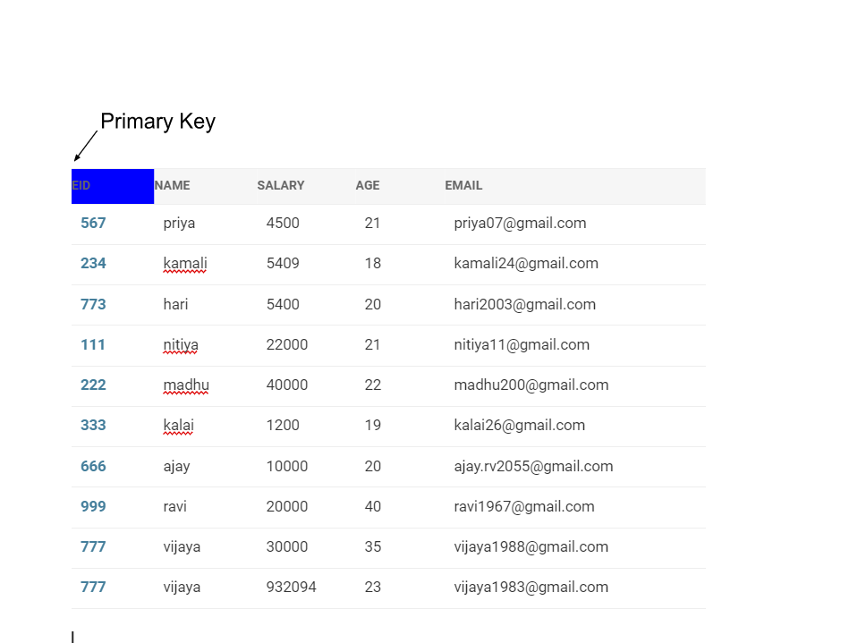
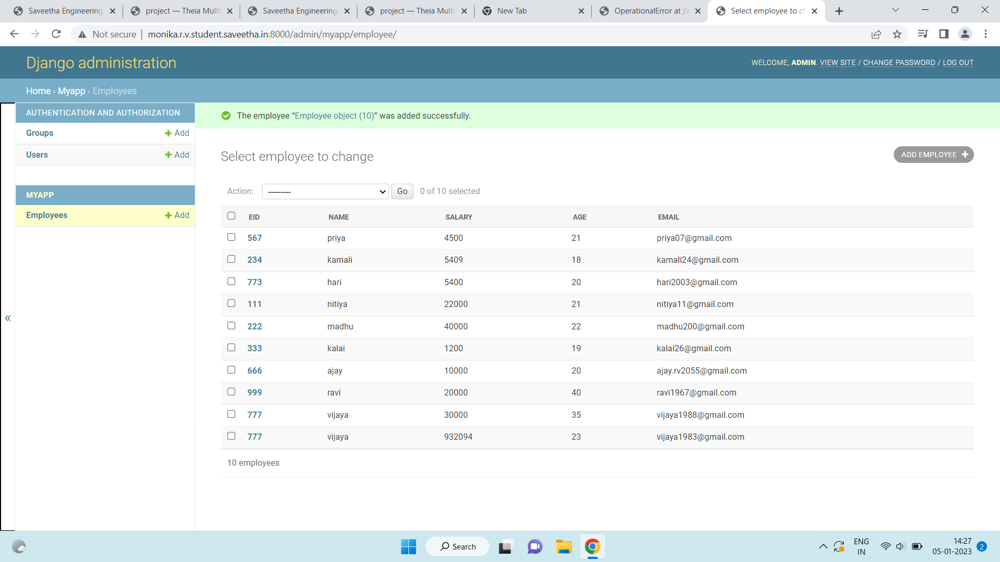

# Django ORM Web Application

## AIM
To develop a Django application to store and retrieve data from a database using Object Relational Mapping(ORM).

## Entity Relationship Diagram



## DESIGN STEPS

### STEP 1:
clone the problem from github
### STEP 2:
create a new app
### STEP 3:
enter the code for admin.py and model.py

## PROGRAM
```
admin.py
from django.contrib import admin
from.models import Employee,EmployeeAdmin
admin.site.register(Employee,EmployeeAdmin)

models.py
from django.db import models
from django.contrib import admin
class Employee(models.Model):
    eid=models.CharField(primary_key="eid",max_length=20,help_text="Employee ID")
    name=models.CharField(max_length=100)
    salary=models.IntegerField()
    age=models.IntegerField()
    email=models.EmailField()
class EmployeeAdmin(admin.ModelAdmin):
     list_display=('eid','name','salary','age','email')
```

## OUTPUT


## RESULT
The program executed successfully